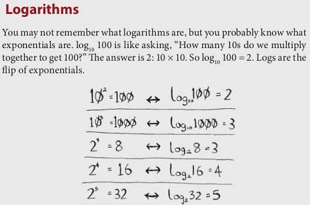
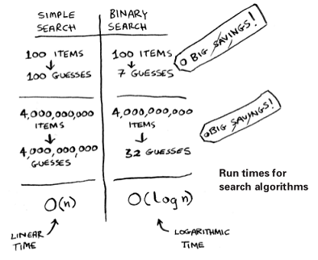
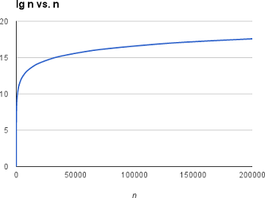

# Binary Search

- Binary search is an example of the famous divide-and-conquer algorithm; its input is a **sorted** list of elements. If an element you're looking for is in that list, binary search returns the position of the item. Otherwise, it returns **null**.

- You can only conduct binary search in ordered lists.

- In general, for any list of `n`, binary search will take **log2n** steps to run in the worst case, whereas simple search will take **n** steps.

  

In the documents, log always means log2.

## Running Time

| Running Time | Log(n) vs n |
| ------------ | ----------- |
|  |  |

When binary search makes an incorrect guess, the portion of the array that contains reasonable guesses is reduced by at least half. If the reasonable portion had 32 elements, then an incorrect guess cuts it down to have at most 16. Binary search halves the size of the reasonable portion upon every incorrect guess.

## Interesting Fact

> According to 'Programming Pearls', only 10% of professional programmers are able to implement binary search in their code. They can explain it very well, but coding it is a challenge for them.
