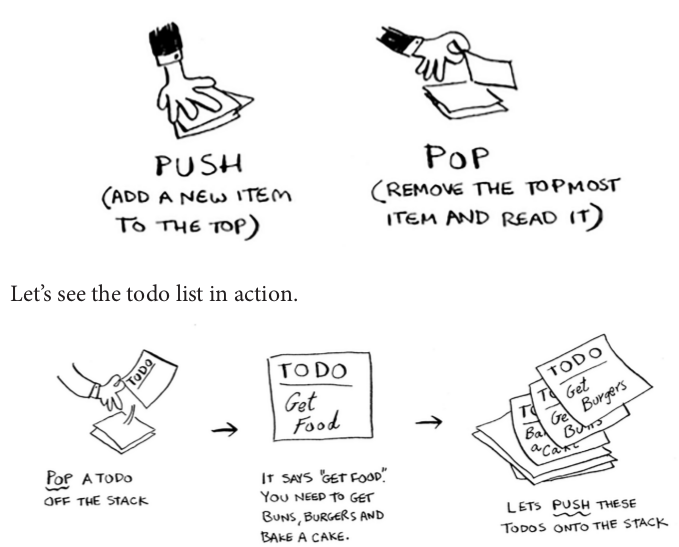
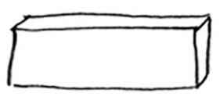
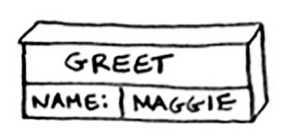
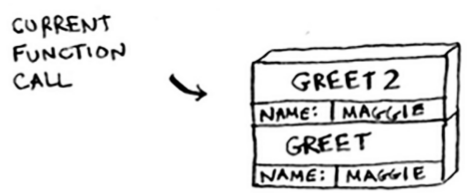
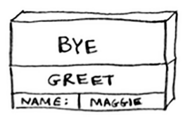
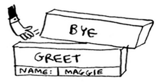
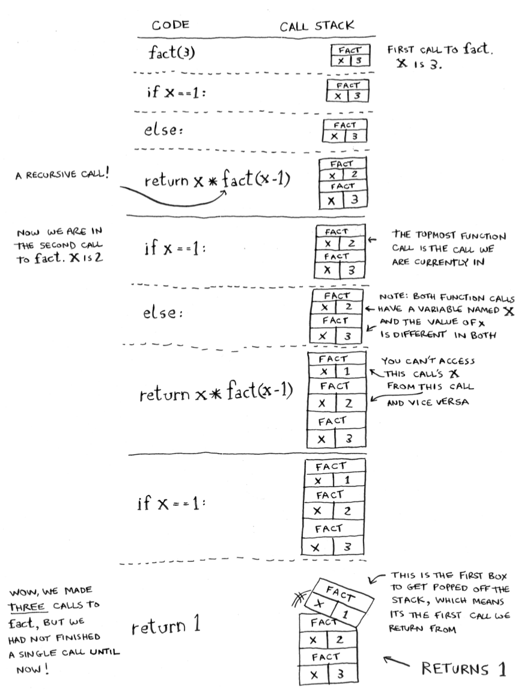
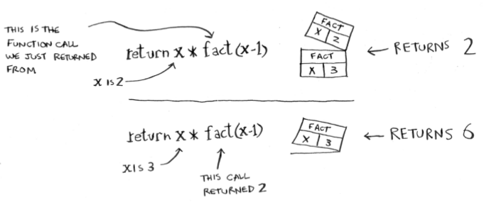

# Stack

- You can think stack analogy of sticky notes!

- When you insert an item, it gets added to the top of the list. When you read an item, you only read the topmost item, and it's taken off the list. So your todo list has only two actions: push (insert) and pop (remove and read).

  

## The Call Stack

- The computer uses a stack internally called the call stack. Let's see it in action:

  ```ruby
  def greet(name)
    print "hello #{name}"
    say_cheers(name)
    bye(name)
  end
  ```

- This function (`greet`), prints something and then calls two other functions (`say_cheers` and `bye`).

- Suppose you call `greet("maggie")`. First, your computer allocates a box of memory for that function call.

  

- Now let's use the memory. The variable name is set to "maggie". That needs to be saved in memory.

  

- Every time you make a function call, your computer saves the values for all the variables for that call in memory like this. Next, you print `hello, maggie!` Then you call `greet2("maggie")`. Again, your computer allocates a box of memory for this function call.

  

- Your computer is using a stack for these boxes. The second box is added on top of the first one. You print `how are you, maggie?`. Then you return from the function call. When this happens, the box on top of the stack gets popped off.

  

- Now the topmost box on the stack is for the `greet` function, which means you returned back to the `greet` function.

- When you called the `say_cheers` function, the `greet` function was partially completed. This is the big idea behind this section: **when you call a function from another function, the calling function is paused in a partially completed state**.

- All the values of the variables for that function are still stored in memory. Now that you're done with the `say_cheers` function, you're back to the `greet` function, and you pick up where you left off. First, you print `getting ready to say bye...`. You call the `bye` function.

  

- A box for that function is added to the top of the stack. Then you print `ok bye!` and return from the function call.

  

- And you're back to the `greet` function. There's nothing else to be done, so you return from the `greet` function too. This stack, used to save the variables for multiple functions, is called the **call stack**.

## The call stack with recursion

- Let's look at this in action with the factorial function. factorial(5) is written as 5!, and it's defined like this: 5! = 5* 4 * 3 * 2 * 1. Similarly, factorial(3) is 3 * 2 * 1. Here's a recursive function to calculate the factorial of a number:

  ```python
  def fact(x):
    if x == 1:
      return 1
    else:
      return x * fact(x-1)
  ```

  

  

- Using the stack is convenient, but there is a cost. Saving all that info can take up a lot of memory. Each of those function calls takes up some memory, and when your stack is too big, that means your computer is saving information for many function calls. **At this point you have two options**:

  1. You can rewrite your code to use a look instead.
  1. You can use something called tail recursion. That's an advanced topic and only supported by some languages.

- Question: What if you accidentally write a recursive function that runs forever?
- Answer: When the program runs out of space, it will exit with a stack-overflow error.

## Recap

- Recursion is when a function calls itself.
- Every recursive function has two cases: the base case and the recursive case.
- A stack has two operations: push and pop.
- All function calls go onto the stack (remember sticky notes).
- The call stack can get very large, which takes up a lot of memory.
