# Breadth First Search

Breadth-first search allows you to find the shortest distance between two things. But shortest distance can mean a lot of things!

You can use breadth-first search to:

- Write a checkers AI that calculates the fewest moves to victory.
- Write a spell checker (fewest edits from your misspelling to a real word—for example, READED -> READER is one edit).
- Find the doctor closest to you in your network.

## Graph

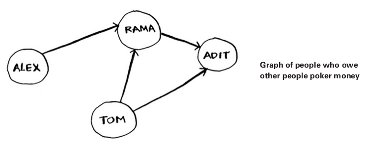

Alex owes Rama money, Tom owes Adit money, and so on. Each graph is made up of nodes and edges.

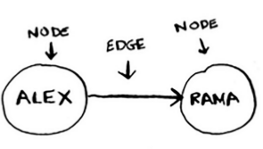

## Tree

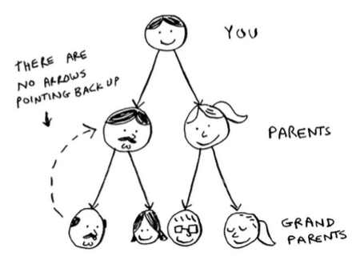

This is called a **tree**. A tree is a special type of graph, where no edges ever point back.

## Breadth-first search

It can help answer two types of questions:

1. Question type 1: Is there a path from node A to node B?
1. Question type 2: What is the shortest path from node A to node B?

You'd prefer a first-degree connection to a second-degree connection, and a second-degree connection to a third-degree connection, and so on. So you shouldn't search any second-degree connections before you make sure you don't have a first-degree connection who is a mango seller. Well, breadth-first search already does this! The way breadth-first search works, the search radiates out from the starting point. So you'll check first-degree connections before second-degree connections.

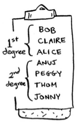

Another way to see this is, first-degree connections are added to the search list before second-degree connections.

You need to search people in the order that they're added. There's a data structure for this: it's called a **queue**.

## Queues

A queue works exactly like it does in real life. Suppose you and your friend are queueing up at the bus stop. If you're before him in the queue, you get on the bus first.

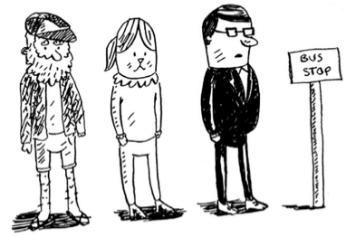

Queues are similar to **stacks**. You can't access random elements in the queue. Instead, there are two only operations, **enqueue** and **dequeue**.

A queue is an abstract data type (ADT).

If you enqueue two items to the list, the first item you added will be dequeued before the second item. You can use this for your search list! People who are added to the list first will be dequeued and searched first.

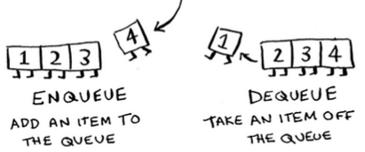

The queue is called a **FIFO** data structure: **First In, First Out**. In contrast, a stack is a **LIFO** data structure: **Last In, First Out**.

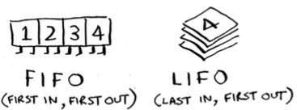

## Implementing the graph

First, you need to implement the graph in code. A graph consists of several nodes. And each node is connected to neighboring nodes.

How do you express a relationship like "you -> bob"? Luckily, you know a data structure that lets you express relationships: a **hash table**! Remember, a hash table allows you to map a key to a value. In this case, you want to map a node to all of its neighbors.

```python
graph = {}
graph["you"] = ["alice", "bob", "claire"]
```

Notice that "you" is mapped to an array. So graph["you"] will give you an array of all the neighbors of "you".

What about a bigger graph, like this one?

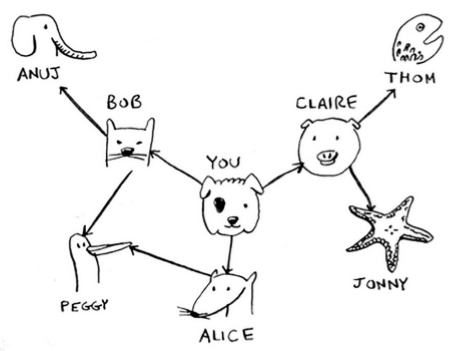

```python
graph = {}
graph["you"] = ["alice", "bob", "claire"]
graph["bob"] = ["anuj", "peggy"]
graph["alice"] = ["peggy"]
graph["claire"] = ["thom", "jonny"]
graph["anuj"] = []
graph["peggy"] = []
graph["thom"] = []
graph["jonny"] = []
```


- When updating queues, I use the terms **enqueue** and **dequeue**. You'll also encounter the terms **push* and **pop**. Push is almost always the same thing as enqueue, and pop is almost always the same thing as dequeue.

- Enqueue, dequeue (or push, pop etc.) takes O(1) constant time.

- We can implement queues as arrays or as linked lists.

## Implementing the Algorithm

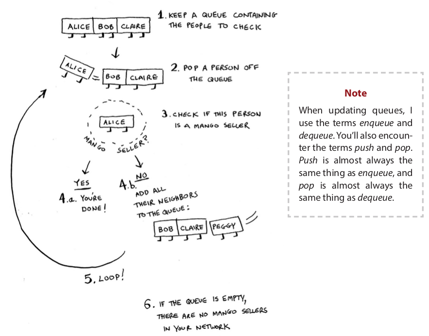

Alice and Bob share a friend: Peggy. So Peggy will be added to the queue twice: once when you add Alice's friends, and again when you add Bob's friends. You'll end up with two Peggys in the search queue.

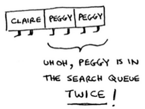

But you only need to check Peggy once to see whether she's a mango seller. If you check her twice, you're doing unnecessary, extra work. So once you search a person, you should mark that person as searched and not search them again.

If you don't do this, you could also end up in an infinite loop. Suppose the mango seller graph looked like this.


- Before checking a person, it's important to make sure they haven't been checked already. To do that, you'll keep a list of people you've already checked.

## Running time

If you search your entire network for a mango seller, that means you'll follow each edge (remember, an edge is the arrow or connection from one person to another). So the running time is at least O(number of edges).

You also keep a queue of every person to search. Adding one person to the queue takes constant time: O(1). Doing this for every person will take O(number of people) total. Breadth-first search takes O(number of people + number of edges), and it's more commonly written as O(V+E) (V for number of vertices, E for number of edges).

## Topological Sort

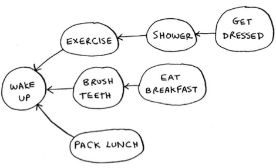

You could say that this list is sorted, in a way. If task A depends on task B, task A shows up later in the list. This is called a **topological sort**, and it's a way to make an ordered list out of a graph.

## Recap

- Breadth-first search tells you if there's a path from A to B.
- If there's a path, breadth-first search will find the shortest path.
- If you have a problem like "find the shortest X" try modeling your problem as a graph, and use breadth-first search to solve.
- A directed graph has arrows, and the relationship follows the direction of the arrow (rama -> adit means "rama owes adit money").
- Undirected graphs don't have arrows, and the relationship goes both ways (ross - rachel means "ross dated rachel and rachel dated ross").
- Queues are FIFO (First In, First Out).
- Stacks are LIFO (Last In, First Out).
- You need to check people in the order they were added to the search list, so the search list needs to be a queue. Otherwise, you won't get the shortest path.
- Once you check someone, make sure you don't check them again. Otherwise, you might end up in an infinite loop.

# Queues in Ruby

- It is especially useful in threaded programming when information must be exchanged safely between multiple threads. The `Queue` class implements all the required locking semantics.

- The `Queue` class is used to synchronize communication between threads. You would use this if you were doing something with concurrency.

  ```ruby
  require 'thread'
  queue = Queue.new

  producer = Thread.new do
    5.times do |i|
      sleep rand(i) # simulate expense
      queue << i
      puts "#{i} produced"
    end
  end

  consumer = Thread.new do
    5.times do |i|
      value = queue.shift
      sleep rand(i/2) # simulate expense
      puts "consumed #{value}"
    end
  end
  ```

## Methods

- `new`: creates a new queue
- `<<`: same as push.
- `clear`: remove all objects from queue.
- `close`: closes the queue. a closed queue cannot be re-opened.
- `closed?`: returns true if the queue is closed.
- `empty?`: returns true if the queue is empty.
- `length`: returns the size of the queue.
- `num_waiting`: returns the number of objects waiting on the queue.
- `push`: add an item to the end of the queue.
- `shift`: remove the first object from queue.
- `pop`: remove the last object from queue.
- `size`: same as length.

## Stack versus Queue

Well, an array can be a stack or queue by limiting yourself to stack or queue methods (push, pop, shift, unshift).

- Stack behavior: Using **push / pop** gives **LIFO (last in first out)** behavior (stack).
- Queue behavior: Using **push / shift** gives **FIFO (first in first out)** behavior (queue).
