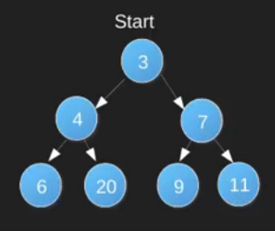
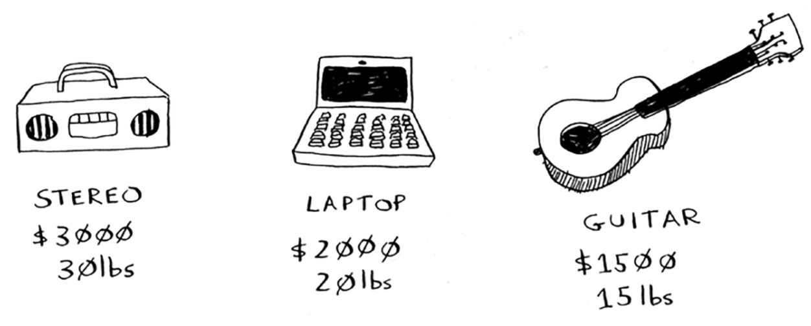
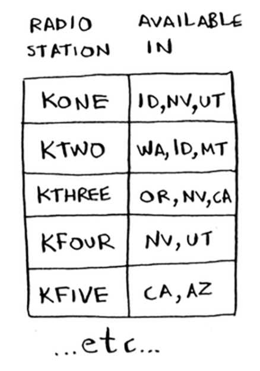
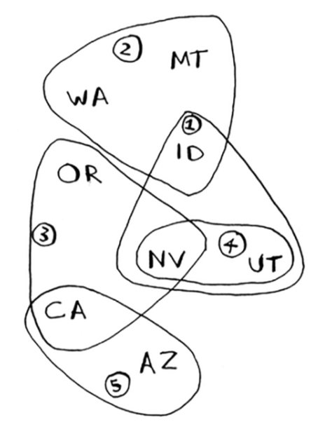
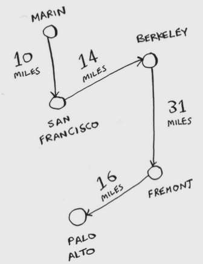

# Greedy Algorithms

- Greedy algorithms are easy.

- Greedy algorithm always targets the most optimum behavior in each step. But why it's called greedy? Let's look at the example here:

  

In this image, we were asked to find the biggest possible sum. If you imitate the greedy algorithm, you would be choosing 7 in the first iteration, and then you would be choosing 11. Finally, the sum would be 3+7+11=21. However, if you've chosen 4 in the first iteration, and then 20, the sum would be 27. Being greedy in the first step didn't help us in this example.

## The classroom scheduling problem

- Suppose you have a classroom and want to hold as many classes here as possible. You get a list of classes.

  

- You want to hold as many classes as possible in this classroom. How do you pick what set of classes to hold, so that you get the biggest set of classes possible?

- Sounds like a hard problem, right? Actually, the algorithm is so easy, it might surprise you. Here's how it works:

  1. Pick the class that ends the soonest.  This is the first class you'll hold in this classroom.
  2. Now, you have to pick a class that starts after the first class. Again, pick the class that ends the soonest. This is the second class you'll hold.

## The knapsack problem

- Suppose you're a greedy thief. You're in a store with a knapsack, and there are all these items you can steal. But you can only take what you can fit in your knapsack. The knapsack can hold 35 pounds.

- You're trying to maximize the value of the items you put in your knapsack. What algorithm do you use? Again, the greedy strategy is pretty simple:

  1. Pick the most expensive thing that will fit in your knapsack.
  2. Pick the next most expensive thing that will fit in your knapsack. And so on.

Your knapsack can hold 35 pounds of items. The stereo system is the most expensive, so you steal that. Now you don't have space for anything else. You got $3,000 worth of goods. But wait! If you'd picked the laptop and the guitar instead, you could have had $3,500 worth of loot!

Clearly, the greedy strategy doesn't give you the optimal solution here. But it gets you pretty close. In the next chapter, I'll explain how to calculate the correct solution. But if you're a thief in a shopping center, you don't care about perfect. “Pretty good” is good enough.

Here's the takeaway from this second example: sometimes, perfect is the enemy of good. Sometimes all you need is an algorithm that solves the problem pretty well. And that's where greedy algorithms shine, because they're simple to write and usually get pretty close.

## The set-covering problem

- This is an example where greedy algorithms are absolutely necessary.

Suppose you're starting a radio show. You want to reach listeners in all 50 states. You have to decide what stations to play on to reach all those listeners. It costs money to be on each station, so you're trying to minimize the number of stations you play on. You have a list of stations. Each station covers a region, and there's overlap.

How do you  gure out the smallest set of stations you can play on to cover all 50 states? Sounds easy, doesn't it? Turns out it's extremely hard. Here's how to do it:

1. List every possible subset of stations. This is called the power set. There are `2^n` possible subsets. For example we have Station 1, Station 2, Station 3 and Station 4. We can make 16 different combinations:

    `0, 1, 2, 3, 4, 12, 13, 14, 23, 24, 34, 123, 124, 134, 234, 1234`

2. From these, pick the set with the smallest number of stations that covers all 50 states.

The problem is, it takes a long time to calculate every possible subset of stations. It takes `O(2^n)` time, because there are `2^n` stations. It's possible to do if you have a small set of 5 to 10 stations. But with all the examples here, think about what will happen if you have 100 items. Suppose you can calculate 10 subsets per second. There's no algorithm that solves it fast enough! What can you do?

## Approximation algorithms

Greedy algorithms to the rescue! Here's a greedy algorithm that comes pretty close:

1. Pick the station that covers the most states that haven't been covered yet. It's OK if the station covers some states that have been covered already.
2. Repeat until all tdsahe states are covered.

This is called an approximation algorithm. When calculating the exact solution will take too much time, an approximation algorithm will work. Approximation algorithms are judged by;

- How fast they are
- How close they are to the optimal solution

Greedy algorithms are a good choice because not only are they simple to come up with, but that simplicity means they usually run fast, too. In this case, the greedy algorithm runs in `O(n^2)` time, where n is the number of radio stations.

In Python, sets are like lists, except sets can't have duplicates.

## Exercises

For each of these algorithms, say whether it's a greedy algorithm or not.

- Quicksort: No. It brings the best solution, not the optimal (approximated) one.
- Breadth-first search: Yes.
- Dijkstra's algorithm: Yes.

## NP-complete problems

To sole the set-covering problem, you had to calculate every possible set.

Maybe you were reminded of the traveling salesperson problem from chapter 1. In this problem, a salesperson has to visit five different cities. And he's trying to figure out the shortest route that will take him to all five cities. To find the shortest route, you first have to calculate every possible route. **How many routes do you have to calculate for five cities?**

It's 5! = 120. Suppose you have 10 cities. How many possible routes are there? 10! = 3,628,800. You have to calculate over 3 million possible routes for 10 cities. As you can see, the number of possible routes becomes big very fast! This is why it's impossible to compute the "correct" solution for the traveling-salesperson problem if you have a large number of cities.

The traveling-salesperson problem and the set-covering problem both have something in common: you calculate every possible solution and pick the smallest/shortest one. Both of these problems are NP-complete.

## Approximating

What's a good approximation algorithm for the traveling salesperson? Something simple that finds a short path. See if you can come up with an answer before reading on. Here's how I would do it: arbitrarily pick a start city. Then, each time the salesperson has to pick the next city to visit, they pick the closest unvisited city. Suppose they start in Marin.

Total distance: 71 miles. Maybe it's not the shortest path, but it's still pretty short.

- Here's the short explanation of NP-completeness: **some problems are famously hard to solve**. The traveling salesperson and the set-covering problem are two examples. A lot of smart people think that it's not possible to write an algorithm that will solve these problems quickly.

- It's nice to know if the problem you're trying to solve is NP-complete. At that point, you can stop trying to solve it perfectly, and solve it using an **approximation** algorithm instead. But **it's hard to tell if a problem you're working on is NP-complete**. Usually there's a very small difference between a problem that's easy to solve and an NP-complete problem.

The short answer: **there's no easy way to tell if the problem you're working on is NP-complete**. Here are some giveaways:

- Your algorithm runs quickly with a handful of items but really slows down with more items.
- Do you have to calculate "every possible version" of X because you can't break it down into smaller sub-problems? Might be NP-complete.
- If your problem involves a sequence (such as a sequence of cities, like traveling salesperson), and it's hard to solve, it might be NP-complete.
- If your problem involves a set (like a set of radio stations) and it's hard to solve, it might be NP-complete.
- Can you restate your problem as the set-covering problem or the traveling-salesperson problem? Then your problem is definitely NP-complete.

## Excercises

- A postman needs to deliver to 20 homes. He needs to find the shortest route that goes to all 20 homes. Is this an NP-complete problem?
  - YES

- Finding the largest clique in a set of people (a clique is a set of people who all know each other). Is this an NP-complete problem?
  - YES

- You're making a map of the USA, and you need to color adjacent states with different colors. You have to find the minimum number of colors you need so that no two adjacent states are the same color. Is this an NP-complete problem?
  - YES

## Recap

- Greedy algorithms optimize locally, hoping to end up with a global optimum.
- NP-complete problems have no known fast solution.
- If you have an NP-complete problem, your best bet is to use an approximation algorithm.
- Greedy algorithms are easy to write and fast to run, so they make good approximation algorithms.
