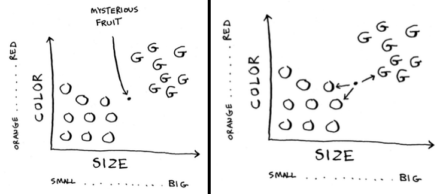
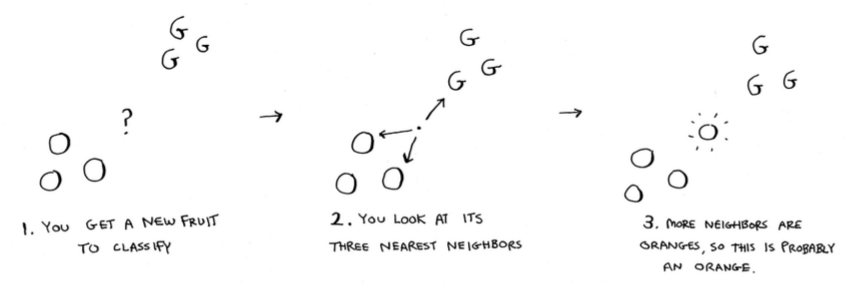
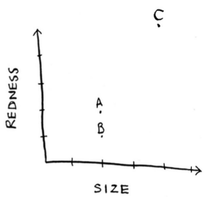
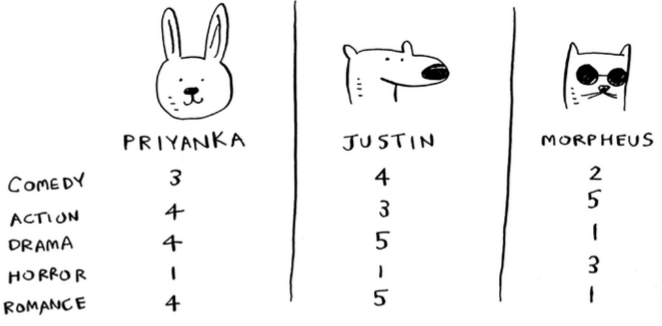

# K-nearest Neighbors

- It's about taking a look to the neighbours and making decisions with them when classifying a data.

  

- More neighbors are oranges than grapefruit. So this fruit is probably an orange. Congratulations: You just used the k-nearest neighbors (KNN) algorithm for classification! The whole algorithm is pretty simple.

  

But there's still a big piece missing. You graphed the fruits by similarity. How do you figure out how similar two fruits are?

## Feature extraction

- In the grapefruit example, you compared fruit based on how big they are and how red they are. Size and color are the features you're comparing.

  

- From the graph, you can tell visually that fruits A and B are similar. Let's measure how close they are. To find the distance between two points, you use the Pythagorean formula.

  

- For Netflix situation, once you can graph users, you can measure the distance between them. Here's how you can convert users into a set of numbers. When users sign up for Netflix, have them rate some categories of movies based on how much they like those categories. For each user, you now have a set of ratings!

  

- Remember how in oranges versus grapefruit, each fruit was represented by a set of two numbers? Here, each user is represented by a set of five numbers. A mathematician would say, instead of calculating the distance in two dimensions, you're now calculating the distance in five dimensions. But the distance formula remains the same.

  

The distance tells you how similar those sets of numbers are.

## Regression

Suppose you want to do more than just recommend a movie: you want to guess how Priyanka will rate this movie. Take the five people closest to her. By the way, I keep talking about the closest five people. There's nothing special about the number 5: you could do the closest 2, or 10, or 10,000. That's why the algorithm is called k-nearest neighbors and not five-nearest neighbors!

Suppose you're trying to guess a rating for Pitch Perfect. Well, how did Justin, JC, Joey, Lance, and Chris rate it? You could take the **average** of their ratings and get 4.2 stars. That's called **regression**. These are the two basic things you'll do with KNN—classification and regression:

- Classification = categorization into a group
- Regression = predicting a response (like a number)

## Picking good features

To figure out recommendations, you had users rate categories of movies. What if you had them rate pictures of cats instead? Then you'd find users who rated those pictures similarly. This would probably be a worse recommendations engine, because the "features" don't have a lot to do with taste in movies!

Or suppose you ask users to rate movies so you can give them recommendations—but you only ask them to rate Toy Story, Toy Story 2, and Toy Story 3. This won't tell you a lot about the users' movie tastes!

When you're working with KNN, it's really important to pick the **right features to compare against**. Picking the right features means:

- Features that directly correlate to the movies you're trying to recommend
- Features that don't have a bias (for example, if you ask the users to only rate comedy movies, that doesn't tell you whether they like action movies)

## Exercice

**Question:** Netflix has millions of users. The earlier example looked at the five closest neighbors for building the recommendations system. Is this too low? Too high?

**Answer:** It's too low. If you look at fewer neighbors, there's a bigger chance that the results will be skewed. A good rule of thumb is, **if you have N users, you should look at `sqrt(N)` neighbors.**

## Introduction to machine learning

### OCR

How would you automatically figure out what number this is (7)? You can use KNN for this:

1. Go through a lot of images of numbers, and extract features of those numbers like curves, points and lines.
2. When you get a new image, extract the features of that image, and see what its nearest neighbors are!

The first step of OCR, where you go through images of numbers and extract features, is called **training**. Most machine-learning algorithms have a training step: before your computer can do the task, it must be trained.

### Building a spam filter

Spam filters use another simple algorithm called the **Naive Bayes classifier**. First, you train your Naive Bayes classifier on some data.

Suppose you get an email with the subject "collect your million dollars now!" Is it spam? You can break this sentence into words. Then, for each word, see what the probability is for that word to show up in a spam email.

## Recap

- KNN is used for classification and regression and involves looking at the k-nearest neighbors.
- Classification = categorization into a group.
- Regression = predicting a response (like a number).
- Feature extraction means converting an item (like a fruit or a user) into a list of numbers that can be compared.
- Picking good features is an important part of a successful KNN algorithm.
