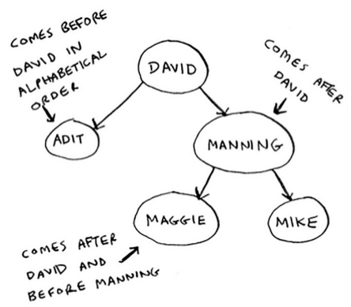
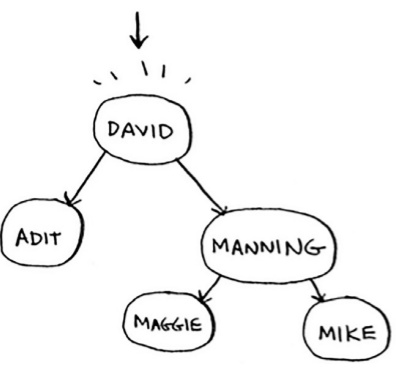
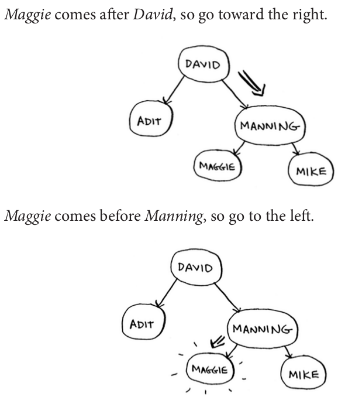
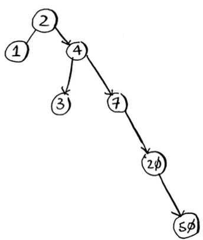
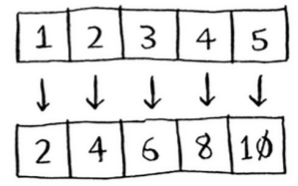
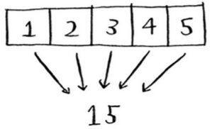

# Where to go next

## Trees

- Let's go back to the binary search example. When a user logs in to Facebook, Facebook has to look through a big array to see if the username exists. We said the fastest way to search through this array is to run binary search. But there's a problem: every time a new user signs up, you insert their username into the array. Then you have to re-sort the array, because binary search only works with sorted arrays. Wouldn't it be nice if you could insert the username into the right slot in the array right away, so you don't have to sort the array afterward? That's the idea behind the **binary search tree** data structure.

For every node, the nodes to its left are smaller in value, and the nodes to the right are larger in value.



Suppose you're searching for Maggie. You start at the root node.





A binary search tree is **a lot faster** for insertions and deletions on average.

|        | Array   | Binary Search Tree |
|------- |---------|--------------------|
| Search | O(logn) | O(logn)            |
| Insert | O(n)    | O(logn)            |
| Delete | O(n)    | O(logn)            |

Binary search trees have some **downsides** too: for one thing, **you don't get random access**. You can't say, "Give me the fifth element of this tree". Those performance times are also on average and rely on the tree being balanced. Suppose you have an imbalanced tree like the one shown next.



See how it's leaning to the right? This tree doesn't have very good performance, because it isn't balanced.

So when are binary search trees used? B-trees, a special type of binary tree, are commonly used to store data in databases. If you're interested in databases or more-advanced data structures, check these out:

- B-trees
- Red-black trees
- Heaps
- Splay trees

## Inverted indexes

A hash that maps words to places where they appear. This data structure is called an **inverted index**, and it's commonly used to build search engines.


## Parallel algorithms

Laptops and computers ship with multiple cores. To make your algorithms faster, you need to change them to run in parallel across all the cores at once!

The best you can do with a sorting algorithm is roughly `O(n logn)`. It's well known that you can't sort an array in `O(n)` time—unless you use a parallel algorithm! There's a parallel version of quicksort that will sort an array in `O(n)` time.

**Parallel algorithms are hard to design**. And it's also **hard to make sure they work correctly** and to figure out what type of speed boost you'll see. One thing is for sure—the **time gains aren't linear**. So **if you have two cores in your laptop** instead of one, that almost **never means your algorithm will magically run twice as fast**. There are a couple of reasons for this:

- Overhead of managing the parallelism: Suppose you have to sort an array of 1,000 items. How do you divide this task among the two cores? Do you give each core 500 items to sort and then merge the two sorted arrays into one big sorted array? Merging the two arrays takes time.

- Load balancing: Suppose you have 10 tasks to do, so you give each core 5 tasks. But core A gets all the easy tasks, so it's done in 10 seconds, whereas core B gets all the hard tasks, so it takes a minute. That means core A was sitting idle for 50 seconds while core B was doing all the work! How do you distribute the work evenly so both cores are working equally hard?

## MapReduce

- There's a special type of parallel algorithm that is becoming increasingly popular: **the distributed algorithm**. It's fine to run a parallel algorithm on your laptop if you need two to four cores, but what if you need hundreds of cores? Then you can write your algorithm to **run across multiple machines**. The MapReduce algorithm is a popular **distributed algorithm**. You can use it through the popular open source tool **Apache Hadoop**.

- Suppose you have a table with billions or trillions of rows, and you want to run a complicated SQL query on it. You can't run it on MySQL, because it struggles after **a few billion rows**. Use MapReduce through Hadoop!

- Distributed algorithms are great when you have a lot of work to do and want to speed up the time required to do it. MapReduce in particular is built up from two simple ideas: the **map function** and the **reduce function**.

### The map function

- The map function is simple: it takes an array and applies the same function to each item in the array. For example, like we're doubling every item in the array.

- Wouldn't it be great if you had 100 machines, and map could automatically spread out the work across all of them? This is the idea behind the "map" in MapReduce.

```python
arr1 = [1, 2, 3, 4, 5]
arr2 = map(lambda x: 2*x, arr1)
```

### The reduce function

- The idea behind `reduce` is that you "reduce" a whole list of items down to one item. With `map`, you go from one array to another:



- With reduce, you transform an array to a single item:



- Summing up all the elements in an array can be an example of reduce.

```python
arr1 = [1, 2, 3, 4, 5]
reduce(lambda x, y: x+y, arr1)
```

## Bloom Filters

Bloom filters are **probabilistic** data structures. They give you an answer that **could be wrong but is probably correct**. Instead of a hash, you can ask your bloom filter if you've crawled an URL before. A hash table would give you an accurate answer. A bloom filter will give you an answer that's **probably correct**:

- False positives are possible. Google might say, "You've already crawled this site" even though you haven't.
- False negatives aren't possible. If the bloom filter says, "You haven't crawled this site" then you definitely haven't crawled this site.

Bloom filters are great because they take up very little space. A hash table would have to store every URL crawled by Google, but a bloom filter doesn't have to do that. They're great when you don't need an exact answer, as in all of these examples.

## Comparing files

SHA is a **hash function**. It generates a hash, which is just a short string. The hash function for hash tables goes from **string to array** index, whereas **SHA goes from string to string**. SHA generates a different hash for every string.

You can use SHA to tell whether two files are the same. This is useful when you have very large files. Suppose you have a 4 GB file. You want to check whether your friend has the same large file. You don't have to try to email them your large file. Instead, you can both calculate the SHA hash and compare it.

## Simhash

In SHA, if you change just one character of the string and regenerate the hash, it's totally different!

This is good because an attacker can't compare hashes to see whether they're close to cracking a password. Sometimes, you want the opposite: you want a locality-sensitive hash function. That's where Simhash comes in. If you make a small change to a string, Simhash generates a hash that's **only a little different**. This allows you to compare hashes and see **how similar two strings are**, which is pretty useful!

- **Google uses Simhash** to detect duplicates while crawling the web.
- A teacher could use Simhash to see whether a student was copying an essay from the web.

Simhash is useful when you want to check for similar items.

## Diffie-Hellman key exchange

How do you encrypt a message so it can only be read by the person you sent the message to?

The easiest way is to come up with a cipher, like a = 1, b = 2, and so on. Then if I send you the message "4, 15, 7", you can translate it to "d, o, g". But for this to work, we both have to agree on the cipher. We can't agree over email, because someone might hack into your email, figure out the cipher, and decode our messages. Heck, even if we meet in person, someone might guess the cipher—it's not complicated. So we should change it every day. But then we have to meet in person to change it every day! Even if we did manage to change it every day, a simple cipher like this is easy to crack with a brute-force attack.

Diffie-Hellman solves both problems:

- Both parties don't need to know the cipher. So we don't have to meet and agree to what the cipher should be.
- The encrypted messages are extremely hard to decode.

Diffie-Hellman has two keys: a public key and a private key. The public key is exactly that: public. You can post it on your website, email it to friends, or do anything you want with it. You don't have to hide it. When someone wants to send you a message, they encrypt it using the public key. An encrypted message can only be decrypted using the private key. As long as you're the only person with the private key, only you will be able to decrypt this message! The Diffie-Hellman algorithm is still used in practice, along with its successor, RSA.

## Linear programming

Linear programming is used to maximize something given some constraints. Linear programming uses the Simplex algorithm. It's a complex algorithm, which is why it's not included here.
