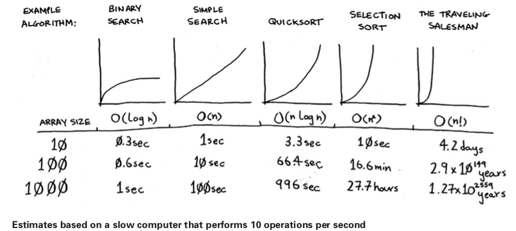
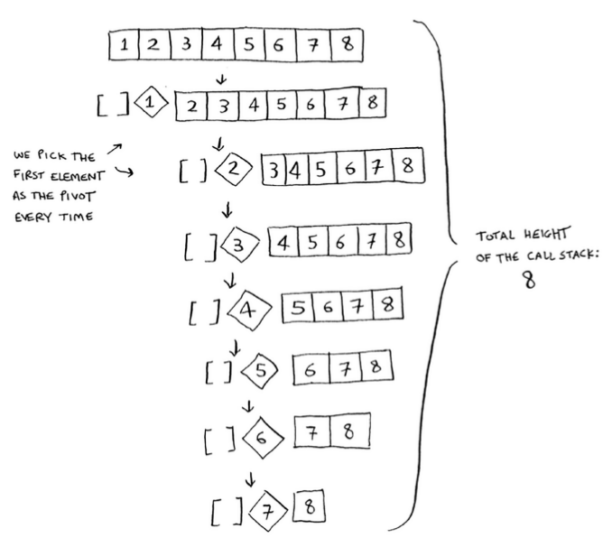
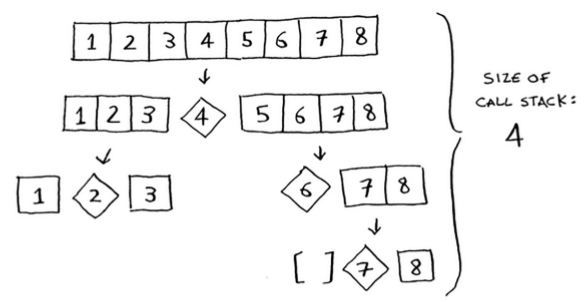
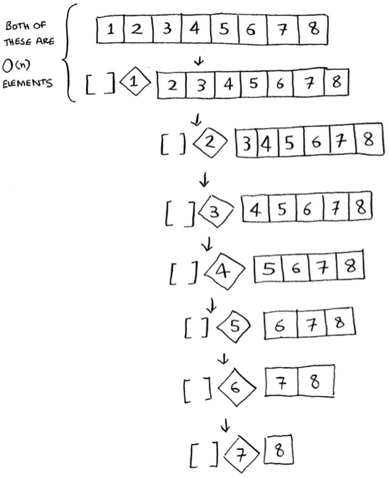
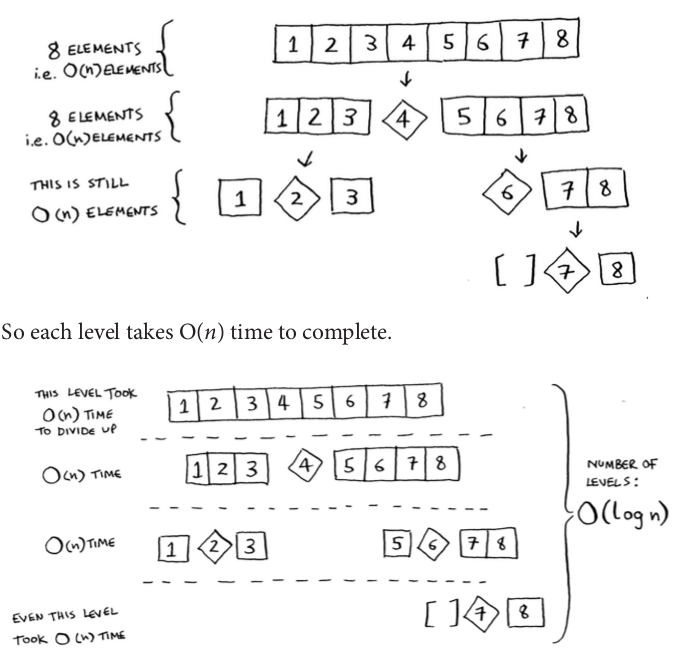

# Big-o-revisited

- Quicksort is unique because its speed depends on the pivot you choose.

- Here are most the common Big-o times:

  

- There is another sorting algorithm called **merge sort**, which is O(n logn). **Quicksort** is a tricky case. In the worst case, quicksort takes O(n2) time. It's as slow as **selection sort**. But that's the worst case. In the average case, quicksort takes **O(n logn)** time.

- You might be wondering:

  1. What do worst case and avarage case mean here?
  1. If quicksort is O(n log n) on avarage, but merge sort is O(n logn) always, why not use merge sort? Isn't it faster?

- We omit constants when stating the big-o, but sometimes the constant can make a difference. Quicksort versus merge sort is one example. Quicksort has a smaller constant than merge sort. So if they are both O(n logn) time, quicksort is faster. And quicksort is faster in practice because it hits the average case way more often than the worst case.

- The worst case for quicksort is trying to sort an array that is already sorted. In other words if our pivot is the biggest or smallest number in the array, then we hit the worst case (to prevent this, we can pick two random items from the array and take their medium):

  

- If we pick the middle element as the pivot:

  

- The first example we saw is the worst-case scenario, and the second example is the best-case scenario. In the worst scenario, the stack size is O(n). In the best case, the stack size is O(log n).

## WTF is `O(n log n)`

Now look at the first level in the stack. You pick one element as the pivot, and the rest of the elements are divided into sub-arrays. You touch all eight elements in the array. So this first operation takes O(n) time. You touched all eight elements on this level of the call stack. But actually, you touch O(n) elements on every level of the call stack.

Even if you partition the array differently, you're still touching O(n) elements every time.

In this example, there are `O(log n)` levels (the technical way to say that is, "The height of the call stack is `O(log n)`"), and each level takes `O(n)` time. The entire algorithm will take `O(n) * O(log n) = O(n log n)` time. This is the best-case scenario. In the worst case, there are `O(n)` levels, so the algorithm will take O(n) * O(n) = O(n2) time.

Quicksort is one of the fastest sorting algorithms out here and it's a very good example of D&C.

## Recap

- D&C works by breaking a problem down into smaller and smaller pieces. If you're using D&C on a list, the base case is probably an empty array or an array with one element.

- If you're implementing quicksort, choose a random element as the pivot. The average runtime of quicksort is `O(n log n)`!

- The constant in Big O notation can matter sometimes. That's why quicksort is faster than merge sort.
